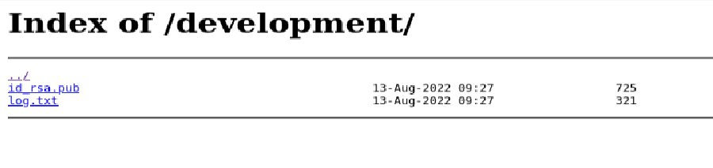
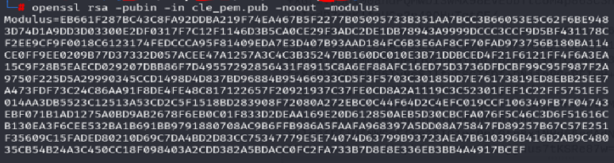
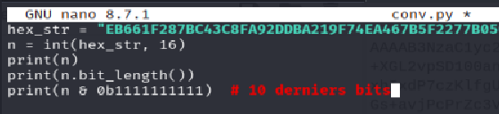
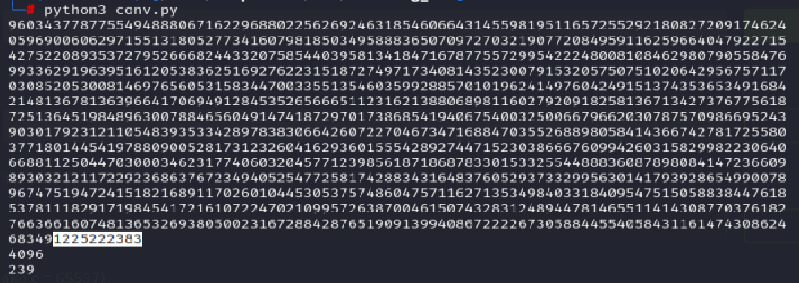

## 1. Network Scan

```bash
nmap -sC -A -Pn [target_ip]
```

```bash
22/tcp open ssh OpenSSH 8.2p1 Ubuntu 4ubuntu0.13 (Ubuntu Linux; protocol 2.0)
| ssh-hostkey:
| 3072 ba:ea:e5:3a:6d:52:eb:51:6f:e5:91:cf:51:8a:4d:e0 (RSA)
| 256 35:62:a2:54:30:2d:3e:15:57:59:98:c4:97:80:6f:aa (ECDSA)
| 256 4e:e8:87:47:36:e7:6b:31:97:c2:88:11:3f:82:d3:40 (ED25519)
80/tcp open http nginx 1.18.0 (Ubuntu)
|http-title: Jack Of All Trades
|http-server-header: nginx/1.18.0 (Ubuntu)
```

How many services are running on the box?

**Response: 2**

## 2. Directory Enumeration

```bash
gobuster dir -u http://[target_ip]/ -w /usr/share/wordlists/dirb/common.txt
```

I found 2 directories:
development  
index.html

**_What is the name of the hidden directory on the web server? (without leading '/')_**

**Response: development**

## 3. Access to /development



I downloaded the `id_rsa.pub` and checked its length with _ssh-keygen_

```bash
ssh-keygen -lf id_rsa.pub
```

**_What is the length of the discovered RSA key? (in bits)_**

**Response: 4096**

I then followed a lot of steps that lead me to the flag:

**Step 1: Convert to PEM**

```bash
ssh-keygen -e -m PEM -f id_rsa.pub > cle_pem.pub
```


**Step 2: Modulus extraction**

```bash
openssl rsa -pubin -in cle_pem.pub -noout -modulus
```



**Step 3: Conversion of hex to decimal**





**_What are the last 10 digits of n? (where 'n' is the modulus for the public-private key pair)_**

**Response: 1225222383**

**Step 4: Factorize**

Factorize n into prime numbers p and q
I wrote a script of factorization with the help of Claude AI

nano break_rsa.py

```python
#!/usr/bin/python3
"""
Script complet pour le CTF "Break RSA" :
1. Extrait n et e depuis la clé publique (id_rsa_pem.pub)
2. Factorise n en p et q via l'algorithme de Fermat (p et q proches)
3. Génère la clé privée correspondante avec pycryptodome

Prérequis :
    pip install pycryptodome --break-system-packages

Avant de lancer, convertis ta clé SSH en PEM :
    ssh-keygen -f id_rsa.pub -e -m PEM > id_rsa_pem.pub
"""

import time
from math import isqrt
from Crypto.PublicKey import RSA
from Crypto.Util.number import inverse

PUBKEY_PATH = "cle_pem.pub"
OUTPUT_PRIVATE_KEY = "id_rsa_recovered"


def load_public_key(path):
    with open(path, "rb") as f:
        key = RSA.import_key(f.read())
    return key.n, key.e


def factorize(n, progress_every=100_000):
    """Factorisation de Fermat : suppose p et q proches."""
    if (n & 1) == 0:
        return (n // 2, 2)

    a = isqrt(n)

    if a * a == n:
        return (a, a)

    a += 1
    count = 0
    t0 = time.time()

    while True:
        _b = a * a - n
        b = isqrt(_b)
        count += 1

        if count % progress_every == 0:
            elapsed = time.time() - t0
            rate = count / elapsed if elapsed > 0 else 0
            print(f"  {count:,} iterations... ({rate:,.0f} it/s)")

        if b * b == _b:
            break

        a += 1

    p = a + b
    q = a - b
    return (p, q)


def generate_private_key(n, e, p, q):
    phi = (p - 1) * (q - 1)
    d = inverse(e, phi)
    key = RSA.construct((n, e, d, p, q))
    return key.export_key()


def main():
    print(f"[*] Loading public key from {PUBKEY_PATH}")
    n, e = load_public_key(PUBKEY_PATH)
    print(f"[*] n bit_length = {n.bit_length()}")
    print(f"[*] e = {e}")
    print(f"[*] last 10 digits of n = {str(n)[-10:]}")

    print("[*] Starting Fermat factorization (this may take a while)...")
    p, q = factorize(n)

    print(f"[+] p = {p}")
    print(f"[+] q = {q}")
    print(f"[+] |p - q| = {abs(p - q)}")

    # Vérification
    assert p * q == n, "Factorisation incorrecte, p*q != n"

    print("[*] Generating private key...")
    private_key_pem = generate_private_key(n, e, p, q)

    with open(OUTPUT_PRIVATE_KEY, "wb") as f:
        f.write(private_key_pem)

    print(f"[+] Private key saved to {OUTPUT_PRIVATE_KEY}")
    print(private_key_pem.decode())


if __name__ == "__main__":
    main()

```

```bash
python3 break_rsa.py
```

**_What is the numerical difference between p and q?_**

**Response: 1502**

**_Generate the private key using p and q (take e = 65537) [Done with the script]_**

**_What is the flag?_**

chmod 600 on the private key and then I finally can connect as the root user.

Ps: In the log.txt file on the /development, I saw a line mentioning root access, which is how I knew the user was root

```bash
ssh root@[target_ip] -i id_rsa
```

**_Flag: REDACTED_**

## Lessons Learned

This room was guided (Fermat's algorithm and a starting point for the script were given), but I still learned a few things from it.

I didn't know about Fermat's factorization before this room. I had to look up how the algorithm worked, and it was only afterward that I understood why it was relevant here: if p and q are too close to each other, n becomes easy to factorize using this method.

Something the writeup doesn't show: my first attempt was a script using only `isqrt`, which failed. It just kept running without ever producing a result. It was only after going back to the room's description that I noticed the hint about the pycryptodome library. That's when Claude helped me modify the script into the final version, which ran almost instantly given how small the gap between p and q actually was (1502).
